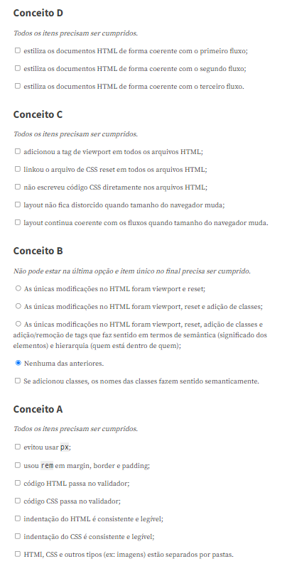

# CoA---Fluxos-de-tela-em-HTML
# Objetivo: passar os sketches dos fluxos de tela do aplicativo para HTML.

## *Data da entrega:* **23h59 do dia 14/03.**

*Link da rubrica de entrega:* https://ensinoai.com/codes/20221/aula6/entrega.html 

